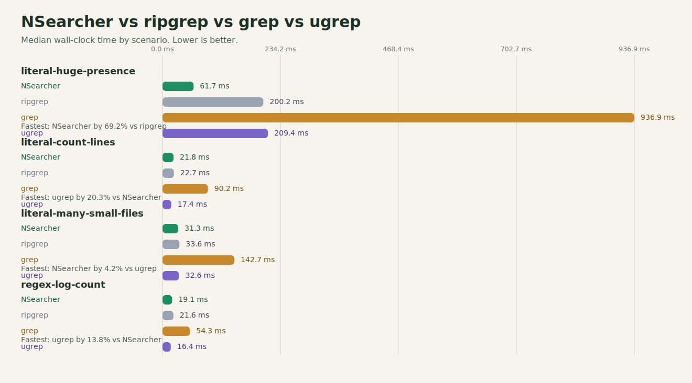
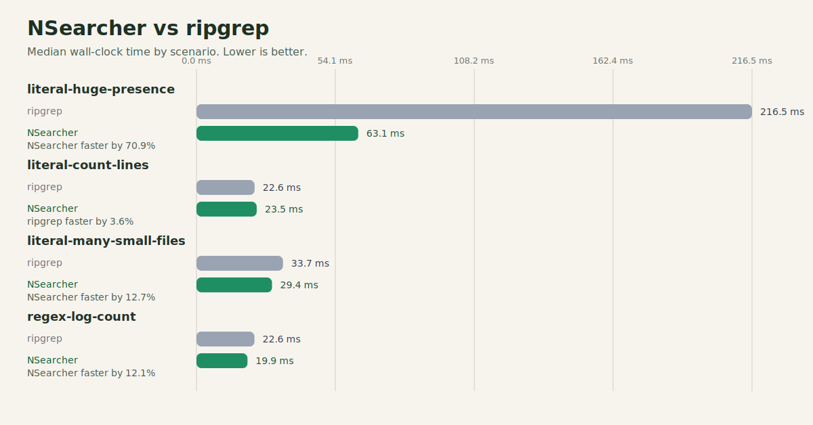

# NSearcher

Fast recursive search for Windows, built to be serious about throughput.

NSearcher is a high-performance CLI search tool for large directory trees and day-to-day codebase work. It focuses on fast literal search, practical regex support, predictable Windows installation, and transparent benchmarking against `ripgrep`, `grep`, and `ugrep`.

## At a glance

- recursive multi-file search with CPU/RAM auto-tuning
- literal and regex search modes
- smart case, `glob` filters, context lines, `-l`, `-c`, `--stats`
- binary-file skipping and sensible default excludes
- native Windows launcher plus .NET 10 search engine
- Native AOT publish when supported
- reproducible local benchmark suite with JSON reports and SVG charts

## Why NSearcher

NSearcher was built with two goals:

1. deliver a genuinely fast Windows-first search experience
2. measure everything honestly instead of hand-waving about performance

That means the project does not hide tradeoffs. The README includes benchmark artifacts, scenario-by-scenario numbers, and a clear view of where NSearcher is already excellent and where other tools still have an edge.

## Quick Start

Install from PowerShell:

```powershell
.\scripts\install.ps1
```

Then open a new terminal and run:

```powershell
NSearcher --help
```

Search examples:

```powershell
NSearcher "invoice" C:\Docs
NSearcher "error \d+" . --regex
NSearcher "auth" src tests -g "*.cs" --exclude "*Generated*"
NSearcher "TODO" . -C 2
NSearcher "needle" . -l
NSearcher "needle" . -c
NSearcher "needle" . --stats
```

Run without installing:

```powershell
dotnet run --project .\NSearcher.Cli -- "needle" . --stats
```

## Installation

### Windows

From source:

PowerShell:

```powershell
.\scripts\install.ps1
```

`cmd.exe`:

```bat
scripts\install.cmd
```

The installer:

- tries Native AOT first
- falls back to a managed .NET publish when AOT is unavailable
- builds a tiny native C launcher when Visual C++ build tools are present
- installs into `%LOCALAPPDATA%\Programs\NSearcher`
- adds that folder to the user `PATH`

Force managed publish mode:

```powershell
.\scripts\install.ps1 -DisableAot
```

Uninstall:

```powershell
.\scripts\uninstall.ps1
```

### Release Bundle

Build a portable Windows release bundle:

```powershell
.\scripts\package-release.ps1 -Version v1.0.1
```

This creates a clean release layout under `artifacts/releases/<version>/win-x64/` with:

- a standalone Windows installer `.exe`
- a portable ZIP package
- `SHA256SUMS.txt`
- `package-manifest.json`
- `RELEASE-NOTES.md`
- an extracted bundle folder containing install/uninstall scripts and the published payload

Run the standalone installer:

```powershell
.\artifacts\releases\<version>\win-x64\NSearcher-Setup-<version>-win-x64.exe
```

Install directly from the extracted bundle:

```powershell
.\artifacts\releases\<version>\win-x64\NSearcher-<version>-win-x64\install.ps1
```

Silent install for automation or package managers:

```powershell
.\artifacts\releases\<version>\win-x64\NSearcher-Setup-<version>-win-x64.exe /quiet
```

## Feature Set

- recursive directory traversal
- multi-threaded scanning with automatic runtime tuning
- literal search fast paths for `files-with-matches` and `count-only`
- regex search with targeted optimizations and prefiltering
- include globs via `-g` and exclude globs via `--exclude`
- before/after context with `-B`, `-A`, `-C`
- hidden-file opt-in via `--hidden`
- binary-file opt-in via `--binary`
- stats output with runtime profile details

Default excludes:

- `.git`
- `.hg`
- `.svn`
- `.vs`
- `bin`
- `obj`
- `node_modules`

## Architecture

Recommended Windows layout:

- `NSearcher.exe`: native C launcher to minimize startup overhead
- `NSearcher.Server.exe`: .NET search engine, published as Native AOT when possible

Core engine characteristics:

- optimized recursive enumeration
- dynamic workload partitioning
- auto-tuned worker count and buffer sizes
- literal prefiltering on large files
- summary-only fast paths for `-l` and `-c`
- benchmark-driven iteration with saved artifacts

## Performance Snapshot

Latest full benchmark validated on `2026-04-03`:

- OS: `Windows 10.0.26200`
- architecture: `x64`
- runtime: `.NET 10.0.5`
- logical processors: `12`
- protocol: `1` warmup + `6` measured runs per scenario
- source report: `artifacts/benchmarks/latest.json`

### Engine vs internal baseline

| Metric | Value |
| --- | ---: |
| Geometric mean speedup | `4.17x` |
| Best scenario | `regex-log-count` |
| Best improvement | `+88.3%` |
| Worst scenario | `literal-count-lines` |
| Worst improvement | `+45.3%` |

### CLI vs external tools

| Comparison | Scenarios won | Geometric mean speedup |
| --- | ---: | ---: |
| NSearcher vs `ripgrep` | `3/4` | `1.44x` |
| NSearcher vs `grep` | `4/4` | `5.29x` |
| NSearcher vs `ugrep` | `1/4` | `1.26x` |

### Scenario breakdown

| Scenario | vs `ripgrep` | vs `grep` | vs `ugrep` |
| --- | ---: | ---: | ---: |
| `literal-huge-presence` | `+70.9%` | `+93.7%` | `+70.6%` |
| `literal-count-lines` | `-3.6%` | `+75.7%` | `-16.1%` |
| `literal-many-small-files` | `+12.7%` | `+77.3%` | `-7.3%` |
| `regex-log-count` | `+12.1%` | `+63.2%` | `-9.1%` |

Interpretation:

- NSearcher is already very strong on heavy literal scanning workloads.
- NSearcher is clearly ahead of classic `grep` on this suite.
- NSearcher is globally ahead of `ripgrep` on this suite.
- `ugrep` still leads on several short, CLI-heavy scenarios.

That last point matters. NSearcher is competitive, but this README does not claim universal dominance across all machines and all workloads.

## Benchmark Charts

Multi-tool comparison:



Focus on NSearcher vs ripgrep:



Latest benchmark artifacts:

- current report: `artifacts/benchmarks/latest.json`
- multi-tool chart: `artifacts/benchmarks/nsearcher-vs-ripgrep-vs-grep-vs-ugrep.svg`
- ripgrep chart: `artifacts/benchmarks/nsearcher-vs-ripgrep.svg`

## Reproducing Benchmarks

Standard suite:

```powershell
dotnet run --project .\NSearcher.Benchmarks -c Release
```

List scenarios:

```powershell
dotnet run --project .\NSearcher.Benchmarks -c Release -- --list
```

Run one scenario:

```powershell
dotnet run --project .\NSearcher.Benchmarks -c Release -- --scenario literal-huge-presence
```

Compare the installed CLI against `ripgrep`, `grep`, and `ugrep`:

```powershell
dotnet run --project .\NSearcher.Benchmarks -c Release -- `
  --compare-ripgrep `
  --compare-grep `
  --compare-ugrep `
  --grep-path "$env:ProgramFiles\Git\usr\bin\grep.exe" `
  --ugrep-path "$env:LOCALAPPDATA\Microsoft\WinGet\Links\ugrep.exe" `
  --nsearcher-cli-path "$env:LOCALAPPDATA\Programs\NSearcher\NSearcher.exe"
```

Install `ugrep` if needed:

```powershell
winget install --id Genivia.ugrep --accept-package-agreements --accept-source-agreements
```

Each benchmark run writes:

- `artifacts/benchmarks/latest.json`
- `artifacts/benchmarks/benchmark-<timestamp>.json`
- `artifacts/benchmarks/nsearcher-vs-ripgrep.svg` when ripgrep comparison is enabled
- `artifacts/benchmarks/nsearcher-vs-ripgrep-vs-grep-vs-ugrep.svg` when CLI comparison is enabled

## Release Automation

GitHub Actions workflow:

- `.github/workflows/release-package.yml`

It builds the Windows package on demand or on `v*` tags, uploads the generated release artifacts, and publishes them to GitHub Releases on tag pushes.

## Build

```powershell
dotnet build .\NSearcher.slnx -c Release
dotnet test .\NSearcher.Core.Tests\NSearcher.Core.Tests.csproj -c Release
dotnet publish .\NSearcher.Cli -c Release -r win-x64 --self-contained false
```

## Current Positioning

NSearcher already has a solid professional base:

- fast engine with measurable gains over the internal baseline
- clean Windows installation story
- transparent benchmark methodology
- strong showing against `ripgrep` and `grep`
- competitive overall position against `ugrep`

The next high-value phase is not reckless micro-optimization. It is consolidation:

- performance non-regression checks
- packaging polish
- CI benchmark automation
- continued CLI ergonomics and documentation quality
